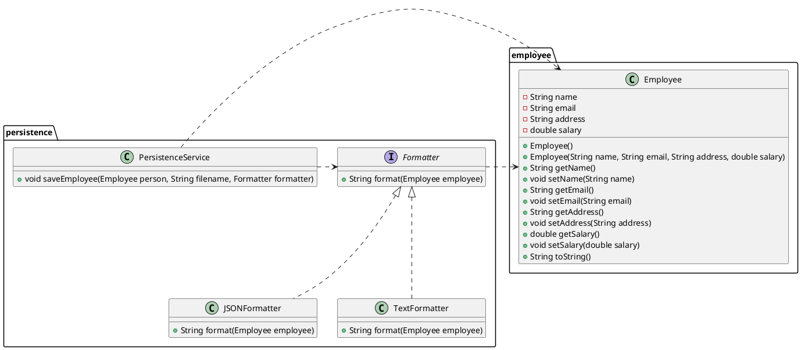

**This is Java Assignment 1 and I have migrated this project to s3ooplabs - assignment01 branch.**

# CST8288 010 Assignment 1 Report

**Student Name:** Xihai Ren  
**Student Number:** 041127486

## UML

The main package is `controller` while the other packages just show the relevant classes.

The main package is `employee` while the other packages just show the relevant classes.

The main package is `persistence` while the other packages just show the relevant classes.

### New Introduced Class

- **EmployeeValidator:** Validates the Employee object to ensure data integrity.
- **EmployeeFormatter:** Provides methods to format Employee String data.
- **ContractEmployeeService:** Defines services specific to contract employees.
- **ContractEmployeeServiceImpl:** Implements the ContractEmployeeService interface.
- **PermanentEmployeeService:** Defines services specific to permanent employees.
- **PermanentEmployeeServiceImpl:** Implements the PermanentEmployeeService interface.
- **PermanentEmployee:** Represents permanent employees as a subclass of the Employee class including attributes specific to permanent employees like years of service, total compensation, and bonuses.
- **ContractEmployee:** Represents contract employees as a subclass of the Employee class including attributes specific to contract employees such as contract renewal dates.
- **EmployeeServiceFactory:** A factory class that creates appropriate EmployeeService instances based on the type of employee following the Simple Factory Design Pattern.
- **PersistenceService:** A service class responsible for persisting employee data, saving formatted employee data in different formats.
- **TextFormatter:** Implements the Formatter interface responsible for saving the Employee object as key-value pairs such as `name=xxxx email=xyz@abc.com`. Provides an additional format option for persisting employee data.

## Application of SOLID Principles

### Single Responsibility Principle

The `EmployeeController` class was split into `EmployeeValidator`, `EmployeeFormatter`, and `PersistenceService` to adhere to the Single Responsibility Principle.

### Open/Closed Principle

- `PermanentEmployee` and `ContractEmployee` inherit from `Employee`.
- `TextFormatter` and `JSONFormatter` implement the `Formatter` interface adhering to the Open/Closed Principle.
- The `EmployeeServiceFactory` class adheres to the Open/Closed Principle by allowing the creation of new types of `EmployeeService` without modifying existing code.

### Liskov Substitution Principle

`PermanentEmployee` and `ContractEmployee` are added to follow the Liskov Substitution Principle, ensuring that subclasses can be substituted for their base class without affecting the program's correctness.

### Interface Segregation Principle

The `EmployeeService` interface was split into `ContractEmployeeService` and `PermanentEmployeeService`, ensuring that clients only need to know about the methods that are relevant to them adhering to the Interface Segregation Principle.

### Dependency Inversion Principle

`EmployeeServiceFactory`, `EmployeeValidator`, `EmployeeFormatter`, and `PersistenceService` are passed as parameters to `EmployeeController`. The `Formatter` interface is passed as a parameter to `PersistenceService`, adhering to the Dependency Inversion Principle.

## UML Diagrams

### Diagram 1

### Diagram 2

